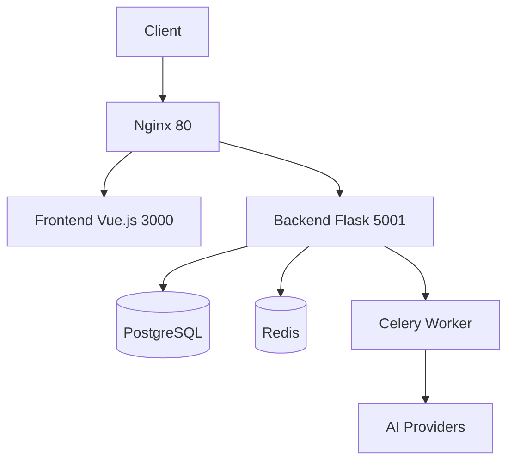

# 🚀 LLMOps - Large Language Model Operations Platform 

[](LICENSE)
[](https://www.python.org/)
[](https://www.docker.com/)
[English](README.md) | [中文](README_ZH.md)
Online address: http://114.132.198.194/
## 🔐 Critical Configuration

**Before deployment, you MUST configure**:

1. Copy the environment template:

   ```bash
   cp .env.example .env
   ```

2. Edit `.env` with your actual credentials:

```ini
# ===== REQUIRED =====
# PostgreSQL Database
SQLALCHEMY_DATABASE_URI=postgresql://postgres:your_strong_password@db:5432/llmops

# Redis Configuration
REDIS_PASSWORD=your_redis_password

# JWT Secret (Generate with: openssl rand -hex 32)
JWT_SECRET_KEY=your_jwt_secret_key_here

# ===== AI PROVIDERS =====
# Configure at least one LLM provider
MOONSHOT_API_KEY=sk-your-moonshot-key
DEEPSEEK_API_KEY=sk-your-deepseek-key
OPENAI_API_KEY=sk-your-openai-key
DASHSCOPE_API_KEY=sk-your-dashscope-key

# ===== OPTIONAL SERVICES =====
# Vector DB (Choose one)
PINECONE_API_KEY=your-pinecone-key
WEAVIATE_API_KEY=your-weaviate-key

# Third-party Services
GAODE_API_KEY=your-gaode-map-key
GITHUB_CLIENT_ID=your-github-oauth-id
GITHUB_CLIENT_SECRET=your-github-oauth-secret
```

## 🚀 Quick Deployment

### Prerequisites

- Docker 20.10+
- Docker Compose 2.0+
- Minimum 8GB RAM

### One-Command Setup

```bash
# Clone repository
git clone https://github.com/Haohao-end/LMForge-End-to-End-LLMOps-Platform-for-Multi-Model-Agents.git
cd Open-Coze/docker

# Configure environment
nano .env  # Fill with your actual credentials

# Launch services
docker compose up -d --build
```

### Service Endpoints

| Service      | Access URL               |
| ------------ | ------------------------ |
| Web UI       | http://localhost:3000    |
| API Gateway  | http://localhost:80      |
| Swagger Docs | http://localhost:80/docs |

## 🛠️ Configuration Guide

### 1. Database Setup

Ensure persistence in `docker-compose.yaml`:

```yaml
services:
  db:
    volumes:
      - pg_data:/var/lib/postgresql/data

volumes:
  pg_data:
```

### 2. Multi-Provider Setup

Comment unused providers in `.env`:

```ini
# Enable OpenAI
OPENAI_API_KEY=sk-xxx
# OPENAI_API_BASE=https://your-proxy.com/v1

# Disable Wenxin
# WENXIN_YIYAN_API_KEY=sk-xxx
```

### 3. Security Best Practices

- Always change default passwords in production

- Enable CSRF protection:

  ```ini
  WTF_CSRF_ENABLED=True
  WTF_CSRF_SECRET_KEY=your_csrf_secret
  ```

## 📊 System Architecture



## 🔧 Troubleshooting

Q: How to check service logs?

```bash
docker compose logs -f
```

Q: How to update environment variables?

```bash
docker compose down
nano .env  # Modify configurations
docker compose up -d
```

Q: Port conflicts?
Modify port mappings in `docker-compose.yaml`:

```yaml
ports:
  - "8080:80"  # Change host port to 8080
```

## 📜 License

MIT License | Copyright © 2025 Open-CozeTeam

