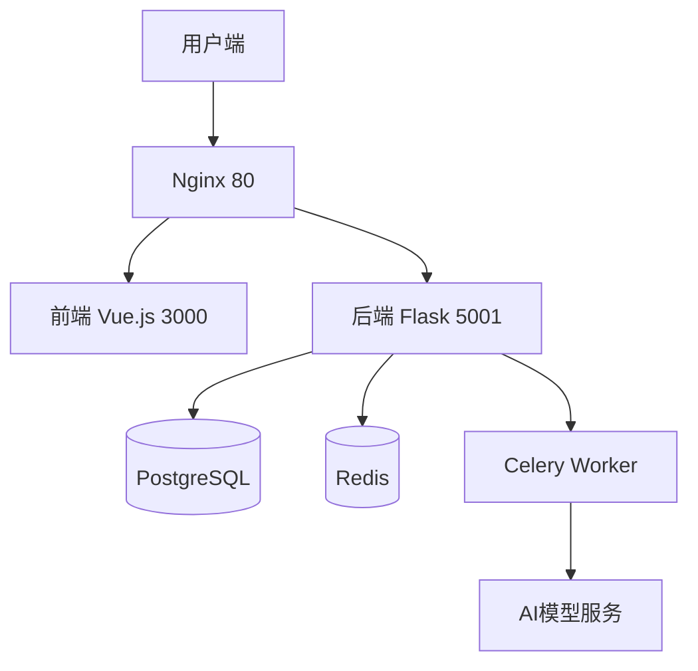

# 🚀 Open-Coze-AI Agent应用开发平台

[](LICENSE)
[](https://www.python.org/)
[](https://www.docker.com/)

企业级大语言模型运维平台，提供模块化架构、多模型支持和全链路监控。

## 🔐 重要配置说明

**部署前必须完成以下配置**：

1. 复制环境变量模板文件：
   ```bash
   cp .env.example .env
   ```

2. 编辑`.env`文件配置以下关键参数：

```ini
# ===== 必填配置 =====
# PostgreSQL数据库
SQLALCHEMY_DATABASE_URI=postgresql://postgres:your_strong_password@db:5432/llmops

# Redis配置
REDIS_PASSWORD=your_redis_password

# JWT密钥 (建议使用openssl rand -hex 32生成)
JWT_SECRET_KEY=your_jwt_secret_key_here

# ===== AI服务商API密钥 =====
# 至少需要配置一个LLM供应商
MOONSHOT_API_KEY=sk-your-moonshot-key
DEEPSEEK_API_KEY=sk-your-deepseek-key
OPENAI_API_KEY=sk-your-openai-key
DASHSCOPE_API_KEY=sk-your-dashscope-key

# ===== 可选服务配置 =====
# 向量数据库 (配置任选其一)
PINECONE_API_KEY=your-pinecone-key
WEAVIATE_API_KEY=your-weaviate-key

# 第三方服务
GAODE_API_KEY=your-gaode-map-key
GITHUB_CLIENT_ID=your-github-oauth-id
GITHUB_CLIENT_SECRET=your-github-oauth-secret
```

## 🚀 快速部署

### 基础环境要求
- Docker 20.10+
- Docker Compose 2.0+
- 至少8GB内存

### 一键启动
```bash
# 克隆仓库
git clone https://github.com/Haohao-end/Open-Coze.git
cd Open-Coze/docker

# 配置环境变量
nano .env  # 填写您的实际配置

# 启动服务
docker compose up -d --build
```

### 服务访问
| 服务类型    | 访问地址                 |
| ----------- | ------------------------ |
| Web前端     | http://localhost:3000    |
| API网关     | http://localhost:80      |
| Swagger文档 | http://localhost:80/docs |

## 🛠️ 配置指南

### 1. 数据库配置
编辑`docker-compose.yaml`确保数据库持久化：
```yaml
services:
  db:
    volumes:
      - pg_data:/var/lib/postgresql/data

volumes:
  pg_data:
```

### 2. 多模型启用
在`.env`中注释不需要的供应商：
```ini
# 启用OpenAI
OPENAI_API_KEY=sk-xxx
# OPENAI_API_BASE=https://your-proxy.com/v1

# 禁用文心一言
# WENXIN_YIYAN_API_KEY=sk-xxx
```

### 3. 安全建议
- 生产环境务必修改默认密码
- 启用WTF_CSRF保护：
  ```ini
  WTF_CSRF_ENABLED=True
  WTF_CSRF_SECRET_KEY=your_csrf_secret
  ```

## 📊 系统架构



## 🔧 常见问题

Q: 如何查看服务日志？
```bash
docker compose logs -f
```

Q: 如何更新环境变量？
```bash
docker compose down
nano .env  # 修改配置
docker compose up -d
```

Q: 端口冲突怎么办？
修改`docker-compose.yaml`中的端口映射或者在终端输入Stop-Service W3SVC关闭80端口：

```yaml
ports:
  - "8080:80"  # 将外部端口改为8080
```

## 📜 许可证
MIT License | Copyright © 2025 

